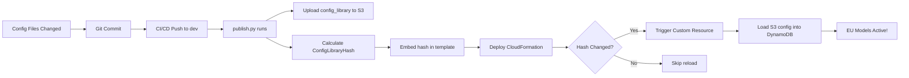

# Configuration Reload Guide

## Issue
After redeploying the stack, the models shown in the UI were US cross-region inference models instead of EU models.

## Root Cause
- Configuration files in S3 have correct EU models
- DynamoDB ConfigurationTable had cached old US models from a previous deployment
- **The Custom Resource SHOULD auto-update when ConfigLibraryHash changes**
- Frontend UI reads from DynamoDB, not S3

## Why the Fix is Robust (Will Survive CI/CD)

✅ **The system is designed to auto-reload configuration on every deployment!**

1. **CI/CD runs `publish.py`** → Uploads `config_library/` to S3
2. **`publish.py` calculates hash** → Hash of `config_library/` directory
3. **Hash embedded in template** → `ConfigLibraryHash` parameter
4. **Custom Resource detects change** → When hash differs from previous deployment
5. **Config reloaded from S3** → DynamoDB updated automatically

**This means:** Future CI/CD deployments WILL reload the configuration if:
- Config files change (hash changes)
- Stack is deployed with the new template (not `--use-previous-template`)

## Solution Applied (One-Time Fix)
Reloaded configuration from S3 into DynamoDB using `reload_config_from_s3.py`

**This was needed because:**
- Previous deployment had US models in DynamoDB
- Config files were updated to EU models
- But no deployment occurred to trigger the reload
- Manual reload was necessary to sync S3 → DynamoDB

## Verified EU Models Now in Use
```
Classification: eu.amazon.nova-pro-v1:0
Extraction: eu.amazon.nova-pro-v1:0
Summarization: eu.anthropic.claude-3-7-sonnet-20250219-v1:0
Assessment: eu.amazon.nova-lite-v1:0
```

## To Reload Configuration After Future Deployments

### ⚠️ You Should NOT Need To Do This

**The CI/CD pipeline automatically reloads configuration** when you deploy via:
- `.github/workflows/deploy-dev.yml` (auto on push to dev)
- `.github/workflows/deploy-prod.yml` (manual trigger)

**Both workflows:**
1. Run `publish.py` → Uploads config_library to S3 with new hash
2. Deploy stack → CloudFormation detects hash change
3. Trigger Custom Resource → Reloads config from S3 to DynamoDB

### If Configuration Still Shows US Models After CI/CD Deploy

This would indicate a problem. Use Option 1 below to manually reload:

### Option 1: Use the Reload Script (Recommended)
```bash
cd /home/josian/git/fiscalshield-idp-core
source activate-env.sh
python3 reload_config_from_s3.py
```

### Option 2: Delete and Redeploy
```bash
# Delete Default configuration
aws dynamodb delete-item \
  --table-name fiscalshield-idp-dev-ConfigurationTable-6UMRLKUMM1UL \
  --key '{"Configuration": {"S": "Default"}}' \
  --region eu-central-1

# Then redeploy the stack
./deploy-pattern2-dev.sh
```

### Option 3: Force Update via Stack Update
Trigger a stack update which will cause the Custom Resource to re-run:
```bash
aws cloudformation update-stack \
  --stack-name fiscalshield-idp-dev \
  --region eu-central-1 \
  --use-previous-template \
  --parameters ParameterKey=AdminEmail,UsePreviousValue=true \
    ParameterKey=AllowedSignUpEmailDomain,UsePreviousValue=true \
    # ... all other parameters with UsePreviousValue=true
  --capabilities CAPABILITY_IAM CAPABILITY_AUTO_EXPAND
```

## Permanent Fix

✅ **Already in place!** The configuration reload mechanism is built into the infrastructure:

### How It Works



### Key Files
- `publish.py` line 1652-1653: Calculates config library hash
- `template.yaml` line 884: Passes hash to Pattern 2
- `patterns/pattern-2/template.yaml` line 1349: Custom Resource with ConfigLibraryHash property
- `src/lambda/update_configuration/index.py`: Custom Resource handler that reloads config

### Verification After Next CI/CD Deploy

```bash
# 1. Make any change and push to dev
echo "# Test" >> README.md
git add README.md
git commit -m "test: verify config reload"
git push origin dev

# 2. Wait for CI/CD to complete (~20 mins)

# 3. Verify models are still EU-based
aws dynamodb get-item \
  --table-name fiscalshield-idp-dev-ConfigurationTable-6UMRLKUMM1UL \
  --key '{"Configuration": {"S": "Default"}}' \
  --region eu-central-1 \
  --query 'Item.{classification: classification.M.model.S, extraction: extraction.M.model.S}' \
  --output json

# Expected: Still shows eu.amazon.nova-pro-v1:0
```

## Verification

Check current models in DynamoDB:
```bash
aws dynamodb get-item \
  --table-name fiscalshield-idp-dev-ConfigurationTable-6UMRLKUMM1UL \
  --key '{"Configuration": {"S": "Default"}}' \
  --region eu-central-1 \
  --query 'Item.{classification: classification.M.model.S, extraction: extraction.M.model.S}' \
  --output json
```

Expected output (EU models):
```json
{
    "classification": "eu.amazon.nova-pro-v1:0",
    "extraction": "eu.amazon.nova-pro-v1:0"
}
```

## All Pattern 2 Configurations Have EU Models

All config files in S3 have been verified to contain EU models:
- ✅ lending-package-sample
- ✅ bank-statement-sample  
- ✅ rvl-cdip-package-sample
- ✅ rvl-cdip-package-sample-with-few-shot-examples

## Notes

- The script `reload_config_from_s3.py` is safe to run multiple times
- It only updates the Default configuration, not Custom overrides
- Changes take effect immediately in the UI
- No stack redeployment needed after running the script
