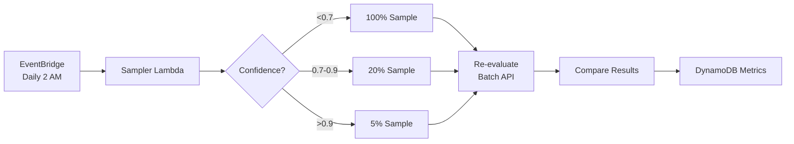

# Evaluation Stack - Quick Start

## What You Get

A complete **automated model evaluation pipeline** that:

✅ **Discovers** your production ExtractionResultsTable automatically  
✅ **Samples** documents intelligently (100% of low-confidence, 5-20% of others)  
✅ **Re-evaluates** using best models (Claude Sonnet 4 in us-east-1)  
✅ **Compares** results field-by-field  
✅ **Tracks** metrics over time in DynamoDB  
✅ **Costs** ~$5/month for 1000 documents (vs $65 for Textract)  

## 5-Minute Deployment

### 1. Prerequisites

```bash
# Verify production stack exists
aws cloudformation describe-stacks \
  --stack-name fiscalshield-idp-dev \
  --region eu-central-1
```

### 2. Deploy

```bash
cd stacks/evaluation
./deploy-evaluation.sh dev --batch
```

That's it! The script will:
- Discover your ExtractionResultsTable
- Build and deploy the evaluation stack
- Optionally trigger a test run

### 3. Monitor

```bash
# Check Step Functions execution
aws stepfunctions list-executions \
  --state-machine-arn <ARN from deployment output> \
  --max-results 1

# Query metrics
aws dynamodb scan \
  --table-name fiscalshield-idp-dev-EvaluationMetrics \
  --max-items 10
```

## How It Works



## Configuration

Edit `deploy-evaluation.sh` or pass parameters:

```bash
sam deploy \
  --parameter-overrides \
    StackName=fiscalshield-idp-dev \
    EvaluationRegion=us-east-1 \
    EvaluationModelId=us.anthropic.claude-sonnet-4-20250514-v1:0 \
    SamplingRate=10 \
    LowConfidenceThreshold=0.7 \
    BatchInferenceEnabled=true
```

## Common Tasks

### Trigger Manual Evaluation

```bash
aws stepfunctions start-execution \
  --state-machine-arn arn:aws:states:eu-central-1:XXX:stateMachine:fiscalshield-idp-dev-EvaluationPipeline \
  --input '{"evaluationType": "manual", "lookbackDays": 7}'
```

### Query Results

```python
import boto3
from boto3.dynamodb.conditions import Key

table = boto3.resource("dynamodb").Table("fiscalshield-idp-dev-EvaluationMetrics")

# Get latest evaluation
response = table.query(
    IndexName="GSI1-ByEvaluationDate",
    KeyConditionExpression=Key("GSI1PK").eq("metrics"),
    ScanIndexForward=False,
    Limit=100
)

# Calculate accuracy
items = response["Items"]
accuracy = sum(1 for i in items if i["ExactMatches"] > i["Mismatches"]) / len(items)
print(f"Overall accuracy: {accuracy:.1%}")
```

### Change Sampling Rates

```bash
aws cloudformation update-stack \
  --stack-name fiscalshield-idp-dev-evaluation \
  --use-previous-template \
  --parameters \
    ParameterKey=LowConfidenceThreshold,ParameterValue=0.6 \
    ParameterKey=MediumConfidenceSamplingRate,ParameterValue=30
```

## FAQ

**Q: How does it find my ExtractionResultsTable with the random suffix?**  
A: Uses pattern matching - looks for tables starting with `{StackName}-ExtractionResultsTable`.

**Q: Will it work if I deploy to a different environment?**  
A: Yes! Just change `StackName` parameter to match your environment.

**Q: Can I use EU models instead of US models?**  
A: Yes, set `EvaluationRegion=eu-central-1` and `EvaluationModelId=eu.anthropic.claude-3-7-sonnet-20250219-v1:0`

**Q: What's the difference between batch and direct mode?**  
A: Batch is 50% cheaper but takes 6-24 hours. Direct is faster (<5 min) but costs 2x.

**Q: How much does this cost?**  
A: ~$5/month for 1000 documents with batch inference. See [ARCHITECTURE.md](ARCHITECTURE.md#cost-breakdown-production-scale).

**Q: Does it modify my production data?**  
A: No! It only reads from ExtractionResultsTable. All results go to separate evaluation tables.

**Q: Can I run this in parallel with production?**  
A: Yes! Completely isolated stack with its own resources.

## Troubleshooting

### Table not found

```bash
# List all tables
aws dynamodb list-tables --region eu-central-1

# Verify table name pattern
aws dynamodb list-tables \
  --query "TableNames[?contains(@, 'ExtractionResultsTable')]"
```

### Lambda timeout

Increase timeout in template.yaml:
```yaml
SamplerFunction:
  Properties:
    Timeout: 900  # Increase if needed
```

### Batch job stuck

Check Bedrock console for batch job status:
```bash
aws bedrock list-model-invocation-jobs \
  --region us-east-1 \
  --max-results 10
```

## Next Steps

1. ✅ Deploy stack
2. ✅ Run test evaluation
3. ⬜ Review metrics in DynamoDB
4. ⬜ Set up CloudWatch dashboard
5. ⬜ Configure SNS alerts for low accuracy
6. ⬜ Integrate with CI/CD for model validation

## Resources

- [Full Architecture](ARCHITECTURE.md) - Detailed design decisions
- [README](README.md) - Complete documentation
- [Bedrock Batch Inference](https://docs.aws.amazon.com/bedrock/latest/userguide/batch-inference.html)
- [Main IDP Stack](../../README.md)

---

**Need Help?** Check [ARCHITECTURE.md](ARCHITECTURE.md) for detailed explanations or open an issue.
